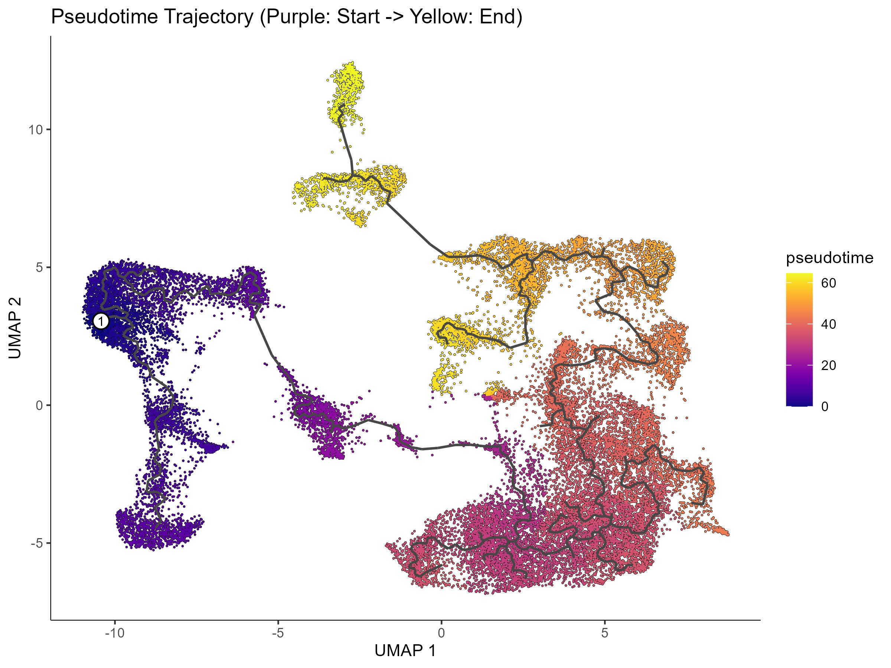

# scRNA-seq Analysis Portfolio: Alveolar Macrophage Study

> **Figure:** Trajectory inference analysis using Monocle3.

This repository documents my **wet-to-dry transition** and self-taught journey in computational biology. It contains R-based workflows for analyzing single-cell RNA sequencing (scRNA-seq) data.
The project validates established pipelines using external datasets (e.g., *Strunz et al. 2020*).

## 📝 Note
This is a personal learning portfolio. The code reflects my progress in mastering bioinformatics pipelines to complement my in vivo research expertise.

---
*Created by [Zheng(Nora)] | PhD Candidate @ Helmholtz Munich*
